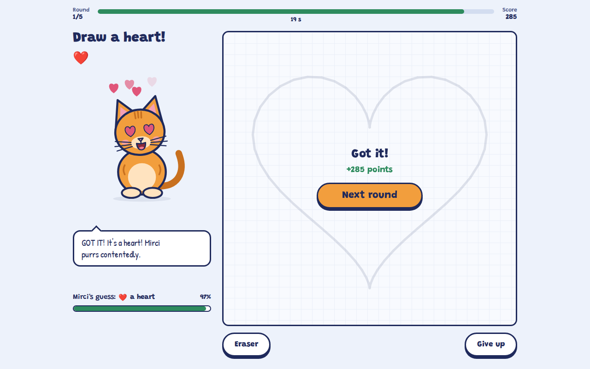
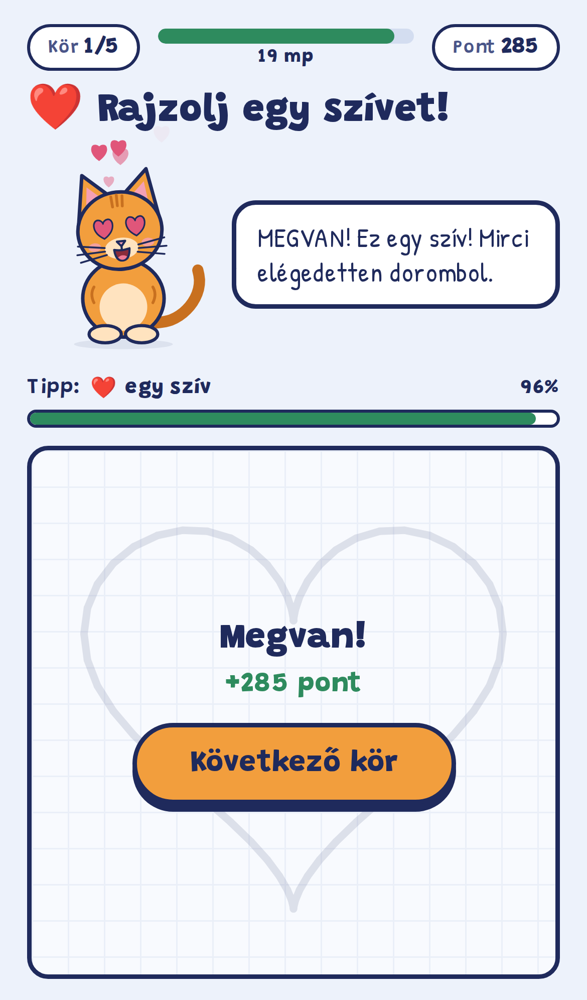

# Rajzolj Mircinek · Draw for Mirci

A drawing game for the browser and for phones (installable as a PWA). Mirci the cat asks you to
draw something. While you draw, she keeps guessing, sometimes spectacularly wrong. In the end she
either accepts your drawing or she doesn't.

**▶ Play: <https://deszepmacskavagymirci.kornel-dc5.workers.dev>** (Hungarian by default, add `?lang=en` for English)

<p align="center">
  
  &nbsp;
  
</p>

- Five rounds, 20 seconds each. The faster Mirci gets it, the more points you earn.
- Mirci asks for 10 easy-to-draw things but can guess 46, so expect a ghost, a snake or a
  cucumber (she is terrified of cucumbers).
- Mirci is an animated SVG cat with 15 moods. You can pet her head or boop her nose; she gets
  grumpy if you pull her tail.
- Every judgement comes from **[Jev](https://developers.cloudflare.com/ai/models/typesafe/jev/)**,
  TypeSafe's structured decision model, running on **Cloudflare Workers AI**.
- Vue 3 + TypeScript, one Cloudflare Worker for both the static app and the API.
  Hungarian and English UI; adding a language takes one file.

## How Mirci sees a drawing

Jev is a text model. It answers typed questions about a piece of text, and it can't look at
images. So the Worker describes the drawing in words (`shared/describe.ts`):

```
3 strokes; the whole drawing is very wide.
Main shape: large oval (wide), at the center of the drawing.
medium triangle, right of the main shape, touching it.
small dot, inside the main shape.
```

It classifies each stroke by geometry (corners, convex hull, fill ratio, self-crossings) and then
relates it to the main shape: inside it, on top of it, or radiating out from it like rays. Before
that it joins strokes that nearly touch and splits a line that crosses itself into its loops.
This is how a fish drawn in one line becomes an oval body plus a triangular tail.

The Worker then asks Jev two typed questions in one call:

| Question | Type | Sees the target? | Drives |
|---|---|---|---|
| `guess` | `choice` over all 46 subjects + `scribble` | no, it guesses blind | the guess meter, Mirci's mood and lines |
| `accept` | `noul` (yes/no probability) | yes | a veto on clearly wrong drawings |

A round is won when the blind guess is the target with at least 50% confidence and `accept`
isn't a clear rejection (see `isAccepted()` in `shared/judge.ts`). One judgement takes about
0.5 s and ~1000 input tokens.

**Accuracy.** A plain ASCII-art rendering of the drawing got 2/22 right. With the verbal
description, 26/30 test drawings are won, across two random seeds. The test set is synthetic
doodles plus drawings traced from real play (`scripts/shapes.mjs`). Scribbles are always rejected.
The mouse is the weakest task; it's often taken for a fish.

## Running it locally

You only need **Docker** and a **Cloudflare account**. Jev only runs on Cloudflare, even in local
development. There is no mock.

```bash
cp .env.example .env   # CLOUDFLARE_ACCOUNT_ID + CLOUDFLARE_API_TOKEN
make dev               # http://localhost:5173
```

The API token needs **Workers AI: Read** and, for deploys, **Workers Scripts: Edit**. Jev is a
third-party model billed through **AI Gateway credits** (unified billing). If a judge call fails
with `2021: Insufficient AI Gateway credits`, top them up in the dashboard. Jev costs $0.042 per
million input tokens (output is free), so a few dollars covers a lot of games.

| Command | What it does |
|---|---|
| `make dev` | Vite dev server with the Worker running in workerd (HMR, real Jev) |
| `make build` | Typecheck (app + Worker) and production build into `dist/` |
| `make deploy` | Build and `wrangler deploy` |
| `make eval` | Judge accuracy on the test drawings (needs `make dev` running) |
| `make describe` | Print the description Jev gets for each test drawing |
| `make types` | Regenerate `worker/worker-configuration.d.ts` after editing `wrangler.jsonc` |
| `make icons` | Render the PWA icons from `public/icons/icon.svg` |
| `make shell` | Shell in the toolchain container, e.g. to `npm i -D something` |

Node, npm and wrangler run only inside the container. Dependencies live in a Docker volume, and
the container runs `npm ci` whenever `package-lock.json` changes.

### Deploying your own copy

Change `name` in `wrangler.jsonc`, then run `make deploy`. The app is served from
`https://<name>.<your-subdomain>.workers.dev`. `/api/judge` is rate-limited to 90 requests per
minute per IP (`JUDGE_LIMITER`), because every call is a paid model call.

## Project layout

```
shared/        Code used by both the client and the Worker
  subjects.ts    Everything Mirci can guess (emoji + model-facing description), and TASK_KEYS
  judge.ts       POST /api/judge contract and the win rule
  describe.ts    Strokes → verbal description
worker/        Cloudflare Worker: validation, rate limit, the Jev call
  jev.ts         Typed Jev wrapper (answer types are inferred from the question definitions)
src/           Vue 3 app
  cat/           Mirci: SVG parts + a requestAnimationFrame engine, moods, gestures
  game/          Game state machine, judge client, Mirci's reactions to certain guesses
  i18n/          Every player-facing string: types.ts, hu.ts, en.ts
  screens/, components/
public/        PWA manifest, service worker, icons
scripts/       Eval harness and test drawings, icon renderer
```

## Contributing

Issues and pull requests are welcome. A few conventions:

- Code and comments are in English. Player-facing text lives only in `src/i18n/`.
- **New language:** implement `Messages` (`src/i18n/types.ts`) in a new file and register it
  in `src/i18n/index.ts`. The compiler flags anything missing.
- **New guessable thing:** add it to `shared/subjects.ts`, give it a clear shape description, and
  add its name to every locale. Add it to `TASK_KEYS` only if `make eval` shows Jev recognises
  it reliably.
- **Recognition changes:** run `make eval` before and after, and add a test drawing for the case
  you fixed to `scripts/shapes.mjs`.
- Run `make build` before opening a PR. It typechecks the app and the Worker.

Debug helpers: `?mood=zany` pins Mirci's mood; `?lang=en` switches language.

## License

[MIT](LICENSE) © 2026 Kovács Kornél
